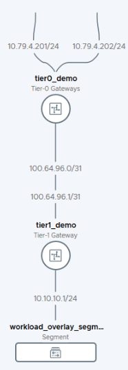

# NSX-T Automation with Terraform

Examples here uses NSX-T Policy API. 

In all iterations, at the end of the Terraform script, there is a static route added to the Ubuntu host which is basically a VM connected to the same VLAN which the Tier0 uplink is connected to. It is purely optional.

## Iteration 1 

This example implements an active / standby Tier 0 configuration with Tier 1 and an overlay segment attached to Tier 1. The overlay segment has a DHCP configured. For now there does not seem to be support for HA VIP config on Tier 0. Hence that needs to be configured manually.

## Iteration 2

This example provisions the same topology as iteration1 however it is fully variable based. Variables default values can be configured to suit the respective environment' s values. 
